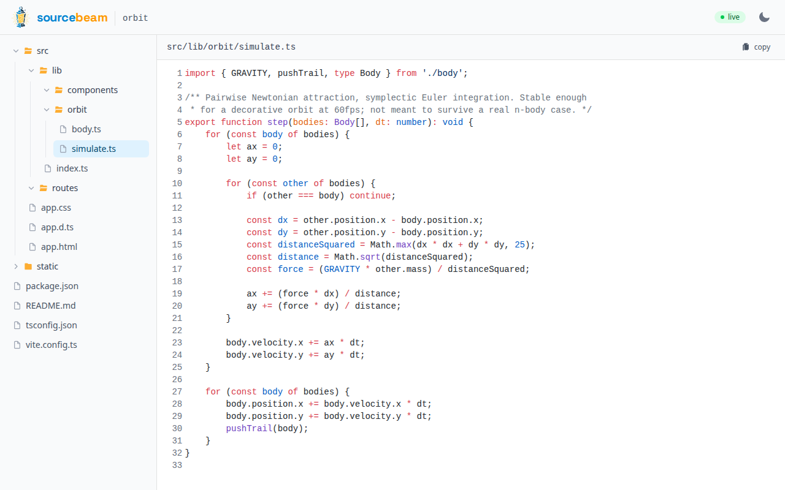
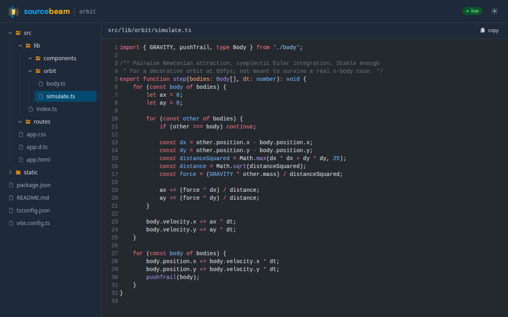

<p align="center">
  <picture>
    <source media="(prefers-color-scheme: dark)" srcset="assets/banner-dark.png">
    
  </picture>
</p>

<p align="center">
  <a href="https://github.com/krowten/sourcebeam/actions/workflows/ci.yml"></a>
  <a href="LICENSE"></a>
</p>

sourcebeam is live code sharing, read-only. The host writes code in their editor, and anyone
with an invite link watches it change in the browser as they type. Viewers can open any file
in the project, but they can't edit anything, and none of the shared code ever runs.

It fits the situations where a screen share is too heavy and write access is too much:
teaching a class, mentoring, live code walkthroughs, review sessions, or pair programming
where one side only needs to watch. If you know VS Code Live Share or JetBrains Code With Me,
think of sourcebeam as the read-only half of those, on your own server.

The server is a Cloudflare Worker with one Durable Object per project; each project keeps its
files in the Durable Object's own SQLite storage, and WebSocket Hibernation means idle rooms
cost nothing. A SvelteKit viewer page ships in the same Worker. There is no CLI watcher. The
clients are editor extensions for VS Code and the JetBrains IDEs, and each one snapshots the
open project, then streams changes over a single WebSocket per session.

## Screenshots

| Light | Dark |
| --- | --- |
|  |  |

## Repository layout

- `apps/web`: the Worker (Durable Object + routing) and the SvelteKit viewer UI
- `packages/protocol`: shared WebSocket protocol types, file policy, invite signing
- `extensions/vscode`: the host-side VS Code extension ([extensions/vscode/README.md](extensions/vscode/README.md))
- `extensions/jetbrains`: the host-side JetBrains IDE plugin ([extensions/jetbrains/README.md](extensions/jetbrains/README.md))
- `docs/`: [the wire protocol](docs/protocol.md) and [self-hosting beyond the quickstart](docs/self-hosting.md)

## Self-host quickstart

sourcebeam runs on your own Cloudflare account. Nobody operates a shared instance for you,
and the free plan is enough for personal use.

```sh
git clone https://github.com/krowten/sourcebeam.git
cd sourcebeam
bun install
bun run deploy
```

`bun run deploy` handles the whole sequence: it logs you into Cloudflare (browser OAuth, if
you aren't logged in already), creates the `HOST_TOKENS` KV namespace, builds and deploys the
Worker, and seeds your first host token. The token is printed once at the end, so save it.
Run with `--dry-run` first if you'd rather see the plan before anything touches your account.
`bun run undeploy` removes all of it again
([details](docs/self-hosting.md#removing-a-deployment)).

Then:

1. **Install the VS Code extension.** Not yet on the Marketplace — see
   [extensions/vscode/README.md](extensions/vscode/README.md#1-install) for downloading a build
   from GitHub Releases (or building it yourself). Then open **Settings…** in the Sourcebeam
   sidebar and fill in the server URL (the `wss://` URL printed by the deploy script) and the
   host token from the deploy summary — both are saved globally, once, for every folder you
   open. The project id defaults to the folder's name. Don't see a token there (it only prints
   once, the first time you deploy) or need another one? Run `bun run token new`. See [Managing
   host tokens](docs/self-hosting.md#managing-host-tokens) for naming, listing and revoking
   tokens — handy when several people share one deployment.

2. **Start broadcasting.** Open the folder to share in VS Code, run
   **Sourcebeam: Start Broadcasting**, then **Sourcebeam: Copy Invite Link** and send that
   link to your viewers.

[extensions/vscode/README.md](extensions/vscode/README.md) has the full host workflow, and
[extensions/jetbrains/README.md](extensions/jetbrains/README.md) covers broadcasting from a
JetBrains IDE instead. [docs/self-hosting.md](docs/self-hosting.md) explains token
management, manual deploys and local development.

## How it works

The editor extension snapshots the open project and streams saves and file events over one
WebSocket, coalescing bursts of changes per file. Every text file the project's `.gitignore`
doesn't exclude is sent, up to a size cap the server publishes on connect; binaries are
skipped. `.gitignore` is the only say over what stays private — keep `.env` files and keys
out of the broadcast by listing them there. The one fixed rule is that nothing under `.git/`
is ever sent.

On the server, the project's Durable Object writes the files to SQLite and fans changes out
to viewers over hibernating WebSockets. Viewers authenticate with a signed, expiring invite
link minted by the host. The host can revoke every outstanding link in one action, or delete
the project outright. [docs/protocol.md](docs/protocol.md) documents the full message flow.

## Contributing

See [CONTRIBUTING.md](CONTRIBUTING.md). The short version: `bun install`, keep every suite
green, and mirror any `packages/protocol` change in the JetBrains plugin's Kotlin port.

## License

[MIT](LICENSE).
